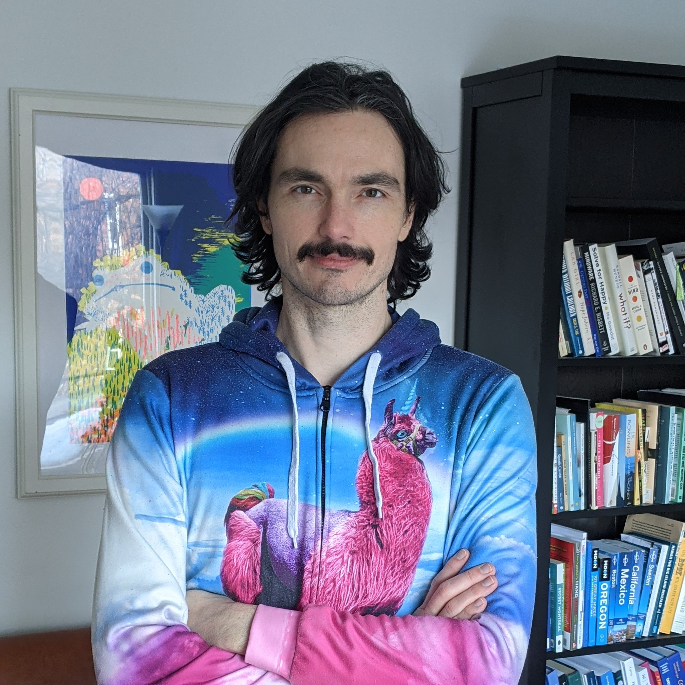

# Good Research Code

```{epigraph}
Is my code fast? No. But is it well documented? No. But does it work? Also no. 

-- [@KyleMorgenstein](https://twitter.com/KyleMorgenstein)
```

## Who is this for?

The primary target audience for this book are grad students and postdocs who do a lot of programming as part of their research. Most people who write a lot of research code are not trained in computer science or software engineering. It can feel like an uphill battle when you have to write code without the right training. You might:

* Feel like you don't know what you're doing
* Feel like an impostor
* Write code with lots of bugs
* Hate your code and don't want to work on it
* Have trouble finishing projects
* Contemplate buying a small organic farm in upstate Vermont and read far too much about goat husbandry

Did I hit a nerve? Yes?! Then you're in for a treat! This book is there to help you get from 0 to 1 on good software engineering practices for research projects. 

## Prerequisites

I've tried to write this book in a progressive manner: some content is targeted at complete novices, other to programmers who are farther along on their journey. However, I generally assume that you have some familiarity with the following:

* **Python**: this intro is Python-centric. You can write good code for Matlab, R, or Julia, but we won't cover that here. You don't need to be a Python expert, but you'll get the most out of this if you've been using Python on a regular basis for at least a month, and if you have some passing familiarity with the python data science ecosystem (numpy, matplotlib, pandas, etc.).
* **Git & Github**: a lot of the practices introduced here will require you to change your code, which could cause existing functionality to break. You might even accidentally delete something important! Mastering git and github means you will have a time machine for your code, so you can revert to an earlier state. [There's a great intro to git for beginners from software carpentries](https://swcarpentry.github.io/git-novice/).
* **The command line**: You will need to run some commands on the command line to implement some of the advice in this book. I'm going to assume that you have some familiarity with running commands from a Unix-style shell (e.g. bash). [There's a great intro to the unix shell from software carpentries](http://swcarpentry.github.io/shell-novice/). If you're using Windows, you will still be able to run many tools from the Windows command prompt. Long term, your life will be easier if you install the Windows Subsystem for Linux (WSL) which will give you access to a Unix-style shell; [I've written a friendly guide to help you do this](wsl.myst). 

Some of the examples I use are neuroscience-inspired - but neuroscience background is absolutely not a requirement. 

## Conventions

This book uses a number of conventions throughout. The command line is indicated by a `$` prompt:

```
$ ls -al
```

The Python command prompt is indicated by `>>>`:

```
$ python
>>> import antigravity
```

Sometimes I will ask you a question, and will hide the answer behind a spoilers panel. For example, what is the answer to life, the universe, and everything?

```{dropdown} ⚠️ Spoilers
42
```

At the end of each main lesson, I ask you to put one of the lessons into practice through a 5-minute exercise. It looks like this:

```{admonition} 5-minute exercise
Brush your teeth. 
```

## Why did I make this?

I did my PhD in computational neuroscience at McGill University, in Montreal. I wrote a lot of not very good code, mostly in Matlab. One time, my code was in a non-working state for an entire month - I would furiously type on the keyboard all day in the hopes it would eventually work, and it didn't. It made me sad. But I managed to graduate. Then I did a postdoc. More of the same. 

Eventually, I decided to properly study CS. I studied data structures, algorithms and software engineering practices, and I got a big-boy job as a software engineer at Google in California. It was then that I learned the error of my ways. I had lost time during my research days because I didn't know how to organize and write code that didn't self-destruct out of spite. But this is fixable! With knowledge!

At the invitation of Ella Batty, I gave a workshop for the students in neuroscience at Harvard on writing good research code. The feedback was overwhelmingly positive, so I decided to expand it into this booklet. I hope you enjoy it!

